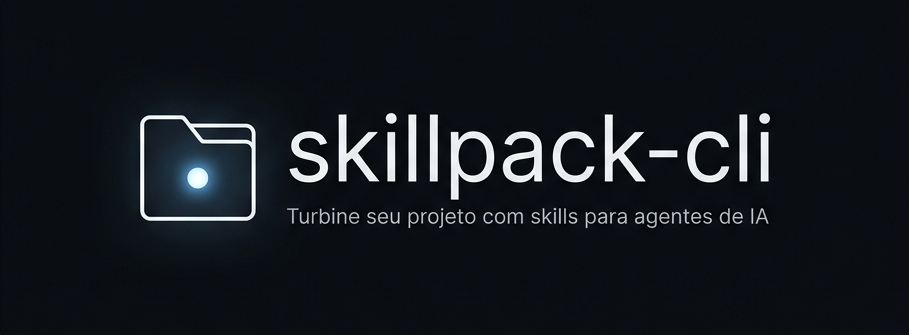

# skillpack-cli



[](https://www.npmjs.com/package/skillpack-cli)
[](https://www.npmjs.com/package/skillpack-cli)
[](https://opensource.org/licenses/MIT)

📦 **NPM:** [npmjs.com/package/skillpack-cli](https://www.npmjs.com/package/skillpack-cli)  
🐙 **GitHub:** [github.com/silvakwan1/skillpack-cli](https://github.com/silvakwan1/skillpack-cli)

CLI que cria/atualiza a pasta `.agents` do seu projeto (com `AGENTS.md` e
`SKILL.md` por framework), pra padronizar como agentes de IA (Claude,
Cursor, Copilot etc.) trabalham no repositório.

## Instalação

```bash
npm i -D skillpack-cli
```

## Uso

```bash
# cria .agents do zero (se não existir) e adiciona a skill de Next.js
npx skills --next

# adiciona a skill de Laravel (mantém o que já existe, só soma)
npx skills --laravel

# várias de uma vez
npx skills --next --laravel

# todas as skills disponíveis
npx skills --all

# ver frameworks suportados
npx skills --list
```

## Comportamento

- **Se `.agents` não existir**: cria a estrutura base (`AGENTS.md`,
  `config.json`, `.manifest.json`) + a(s) skill(s) pedida(s) e copia os arquivos de configuração adicionais (como `opencode.json`, `.cursorrules`, `.claudeprompt`, `.vscode`) para a raiz do projeto.
- **Se `.agents` já existir**: só adiciona as skills que ainda não foram
  aplicadas. Skills já aplicadas (registradas em `.agents/.manifest.json`)
  não são sobrescritas — suas edições manuais em `SKILL.md` são
  preservadas.

## Estrutura gerada

```
.
├── opencode.json         # config do OpenCode
└── .agents/
    ├── AGENTS.md         # regras gerais do agente
    ├── config.json       # config editável
    ├── .manifest.json    # controle interno — não editar
    └── skills/
        ├── next/
        │   └── SKILL.md      # regras específicas de Next.js
        └── laravel/
            └── SKILL.md      # regras específicas de Laravel
```

## Adicionar um novo framework

1. Crie `templates/<nome>/.agents/SKILL.md` com as regras.
2. Registre em `src/utils/frameworks.ts`:

```ts
express: {
  flag: 'express',
  label: 'Express',
  templateDir: 'express',
},
```

Pronto — `npx skills --express` já funciona.
