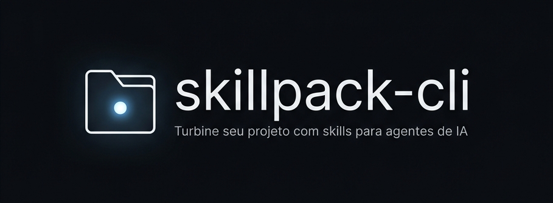

# skillpack-cli



[](https://www.npmjs.com/package/skillpack-cli)
[](https://www.npmjs.com/package/skillpack-cli)
[](https://opensource.org/licenses/MIT)

📦 **NPM:** [npmjs.com/package/skillpack-cli](https://www.npmjs.com/package/skillpack-cli)  
🐙 **GitHub:** [github.com/silvakwan1/skillpack-cli](https://github.com/silvakwan1/skillpack-cli)

CLI que cria/atualiza a pasta `.agents` do seu projeto (com `AGENTS.md`, `agents/` e `skills/` por framework), pra padronizar como agentes de IA (Claude, Cursor, Copilot, Antigravity etc.) trabalham no repositório.

## Uso sem Instalar (On-Demand)

Você pode rodar diretamente sem instalar nada no seu projeto usando `npx skillpack-cli`:

```bash
# cria .agents do zero e adiciona a skill de JavaScript
npx skillpack-cli --js

# cria .agents e adiciona Next.js e Laravel
npx skillpack-cli --next --laravel

# adiciona todas as skills disponíveis
npx skillpack-cli --all

# ver frameworks suportados
npx skillpack-cli --list
```

## Uso Instalado no Projeto

Se preferir manter a lib nas dependências do projeto:

```bash
npm i -D skillpack-cli
```

Após instalar, você pode usar qualquer um dos atalhos disponíveis:

```bash
npx skills --js
# ou
npx skillpack-cli --next
```

## Comportamento

- **Se `.agents` não existir**: cria a estrutura base (`AGENTS.md`, `config.json`, `.manifest.json`) + skills universais + agentes em `.agents/agents/` (com versões `.yml` e `SKILL.md`) + a(s) skill(s) pedida(s) e copia os arquivos de configuração adicionais (como `opencode.json`, `.cursorrules`, `.claudeprompt`, `.vscode`) para a raiz do projeto.
- **Se `.agents` já existir**: só adiciona as skills que ainda não foram aplicadas. Skills já aplicadas (registradas em `.agents/.manifest.json`) não são sobrescritas — suas edições manuais são preservadas.

## Skills Universais (Base)

Ao rodar qualquer comando, as seguintes skills universais são instaladas automaticamente (se ainda não existirem):

| Skill | Descrição |
|-------|-----------|
| `security-audit` | Auditoria de segurança: OWASP Top 10, secrets, dependências, XSS/CSRF/SQLi |
| `code-review` | Revisão de código multi-eixo: corretude, legibilidade, arquitetura, performance |
| `git-workflow` | Padrões de Git: commits semânticos, branching, PR descriptions, changelog |
| `performance` | Otimização de performance: profiling, bundle size, queries, caching |
| `documentation` | Geração de docs: README, ADRs, API docs, JSDoc/TSDoc, CHANGELOG |
| `testing` | Estratégia de testes: unitários, integração, E2E, coverage, mocking |
| `backend` | Padrões universais de Backend: APIs REST/GraphQL, Prisma, SQL, JWT, Zod |
| `frontend` | Padrões universais de Frontend: Componentes visuais, WCAG, Mobile-first, React Hook Form |

## Agentes em `.agents/agents/` (Dual Format: .yml & SKILL.md)

Todos os agentes são fornecidos com versão **Markdown (`SKILL.md`)** e **YAML (`.yml`)**:

| Agente | Diretório | Skills Atribuídas |
|--------|-----------|-------------------|
| Arquiteto de Software | `.agents/agents/architect/` | security-audit, performance, code-review |
| Revisor de Código | `.agents/agents/code-reviewer/` | code-review, security-audit, testing |
| DevOps Engineer | `.agents/agents/devops/` | git-workflow, security-audit, performance |
| Documentador | `.agents/agents/documentador/` | documentation, code-review |
| QA Lead | `.agents/agents/qa-lead/` | testing, security-audit, code-review, performance |
| Backend Dev Sênior | `.agents/agents/backend-dev/` | backend, security-audit, code-review |
| Frontend Dev Sênior | `.agents/agents/frontend-dev/` | frontend, code-review, performance |

## Estrutura Gerada

```
.
├── opencode.json         # config do OpenCode
└── .agents/
    ├── AGENTS.md         # regras gerais dos agentes
    ├── config.json       # config editável
    ├── .manifest.json    # controle interno — não editar
    ├── agents/           # agentes com suporte dual (.yml e SKILL.md)
    │   ├── architect/
    │   │   ├── SKILL.md
    │   │   └── architect.yml
    │   ├── code-reviewer/
    │   │   ├── SKILL.md
    │   │   └── code-reviewer.yml
    │   ├── devops/
    │   ├── documentador/
    │   └── qa-lead/
    └── skills/
        ├── security-audit/
        ├── code-review/
        ├── git-workflow/
        ├── performance/
        ├── documentation/
        ├── testing/
        ├── backend/
        ├── frontend/
        └── js/
```

## Adicionar um novo framework

1. Crie `templates/<nome>/.agents/skills/<nome>/SKILL.md` com as regras.
2. Registre em `src/utils/frameworks.ts`:

```ts
js: {
  flag: 'js',
  label: 'JavaScript (Generic)',
  templateDir: 'js',
},
```

Pronto — `npx skills --js` já funciona.

## Proteção contra sobrescrita

O CLI **nunca** sobrescreve arquivos que você editou manualmente:

- Skills universais e agentes são rastreados no `.manifest.json`.
- Se um arquivo já existe no seu projeto, ele é preservado.
- Novas skills/agentes adicionados em updates futuros da lib são instalados automaticamente sem afetar os existentes.
